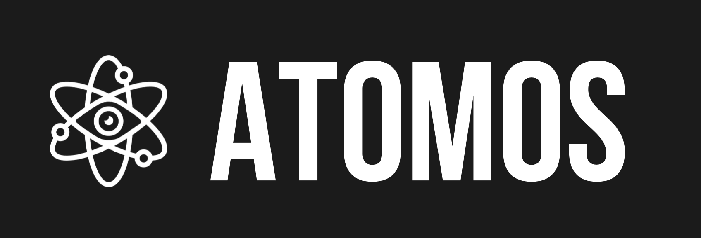
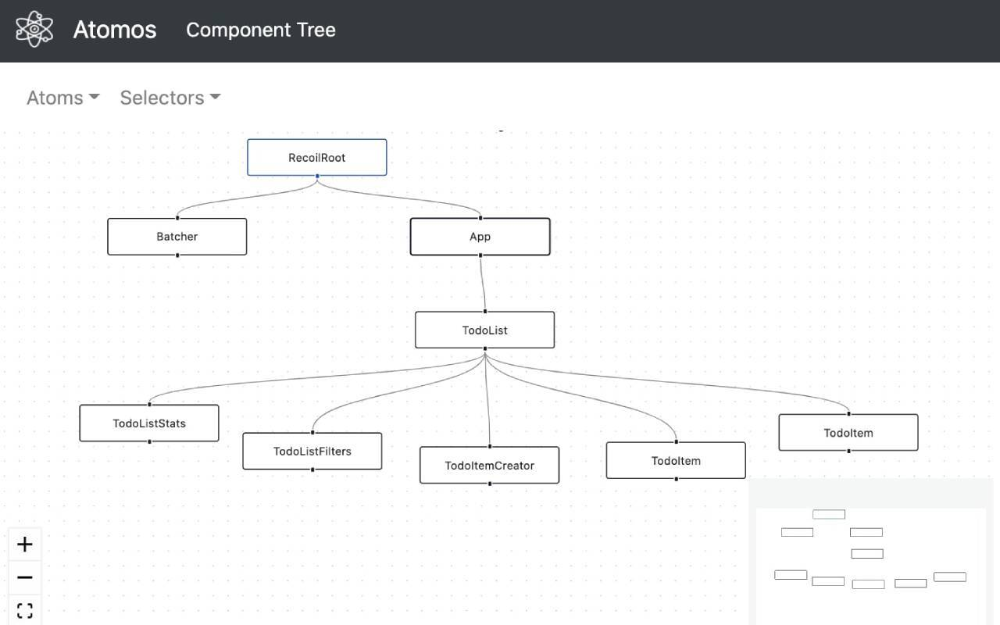
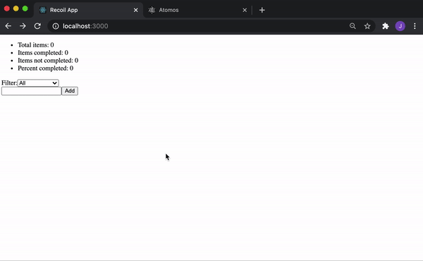
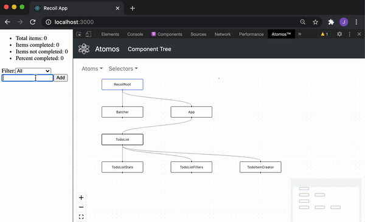
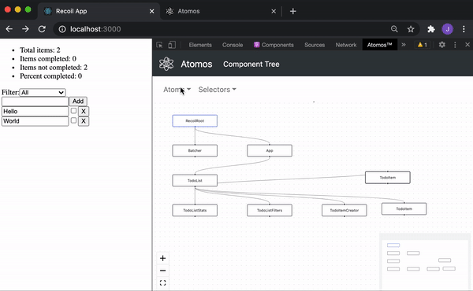

<!-- PROJECT SHIELDS -->
<!--
*** I'm using markdown "reference style" links for readability.
*** Reference links are enclosed in brackets [ ] instead of parentheses ( ).
*** See the bottom of this document for the declaration of the reference variables
*** for contributors-url, forks-url, etc. This is an optional, concise syntax you may use.
*** https://www.markdownguide.org/basic-syntax/#reference-style-links
-->
[![Contributors][contributors-shield]][contributors-url]
[![Forks][forks-shield]][forks-url]
[![Stargazers][stars-shield]][stars-url]
[![Issues][issues-shield]][issues-url]
[![MIT License][license-shield]][license-url]
[![LinkedIn][linkedin-shield]][linkedin-url]


<!-- PROJECT LOGO -->
<br />
<p align="center">
  <a href="https://github.com/oslabs-beta/atomos">
    
  </a>

  <h3 align="center">Atomos</h3>

  <p align="center">
    Atomos is an open source Chrome developer tool for Recoil that provides real-time visualization of the component tree and atom-selector relationships to facilitate the debugging of a React application. <br /> Atomos was developed under tech accelerator OSLabs.
    <br /><br />
    <a href="https://www.getatomos.io"><strong>getatomos.io</strong></a>
    <br />
    <br />
    <a href="https://www.getatomos.io">View Demo</a>
    ·
    <a href="https://github.com/oslabs-beta/atomos/issues">Report Bug</a>
    ·
    <a href="https://github.com/oslabs-beta/atomos/issues">Request Feature</a>
  </p>
</p>


<!-- TABLE OF CONTENTS -->
<details open="open">
  <summary>Table of Contents</summary>
  <ol>
    <li>
      <a href="#about-the-project">About The Project</a>
      <ul>
        <li><a href="#built-with">Built With</a></li>
      </ul>
    </li>
    <li>
      <a href="#getting-started">Getting Started</a>
      <ul>
        <li><a href="#prerequisites">Prerequisites</a></li>
        <li><a href="#installation">Installation</a></li>
      </ul>
    </li>
    <li><a href="#features">Features</a></li>
    <li><a href="#contributing">Contributing</a></li>
    <li><a href="#license">License</a></li>
    <li><a href="#core-team">Core Team</a></li>
  </ol>
</details>


<!-- ABOUT THE PROJECT -->
## About The Project

<p align="center">
  
</p>

Atomos is an open source Chrome developer tool designed for Recoil, Facebook's experimental state management library. Atomos provides real-time visualizations of a React/Recoil application’s structure and state to ensure more stable, performant code, less time spent debugging, and faster development cycles.

Key features of our developer tool include:
* Dynamically rendered component tree visualizations which update with state changes
* Atom and selector dropdown menus to view advanced component data
* Clean and intuitive UI, developed with React Flow
* Seamless integration with React Devtools
* Quick and easy Chrome extension installation

<ins>Please note that Atomos is still in beta.</ins>


### Built With

* [Recoil](https://recoiljs.org/)
* [React](https://reactjs.org/)
* [React Fiber](https://github.com/acdlite/react-fiber-architecture)
* [React Flow](https://recoiljs.org/)
* [React Router](https://reactrouter.com/)
* [React Bootstrap](https://react-bootstrap.github.io/)
* [Chrome DevTools](https://developers.google.com/web/tools/chrome-devtools)
* [Webpack](https://webpack.js.org/)
* [Jest](https://jestjs.io/)


<!-- GETTING STARTED -->
## Getting Started

To get a local copy up and running, follow these simple steps.

### Prerequisites

The React Developer Tools Chrome <a href="https://chrome.google.com/webstore/detail/react-developer-tools/fmkadmapgofadopljbjfkapdkoienihi?hl=en">extension</a> is required for Atomos to run.

### Installation

<strong><ins>To get started, download the Atomos [extension](https://chrome.google.com/webstore/detail/atomos/hdoljekhdmbkopfbcdljnjmjkgfgoebi?hl=en) from the Chrome Web Store.</ins></strong>

Alternatively, you can manually install Atomos in [Developer mode](https://developer.chrome.com/docs/extensions/mv3/faq/#faq-dev-01).

1. Clone the repo
   ```sh
   git clone https://github.com/oslabs-beta/atomos.git
   ```
2. Install NPM packages
   ```sh
   npm install
   ```
3. Create a build directory
   ```sh
   npm run build
   ```
4. Load the unpacked extension from `src/extension/build` to Chrome


<!-- USAGE EXAMPLES -->
## Features
<p align="center">
  
  <h3 align="center"><ins>Component Tree</ins></h3>
  <p align="center">
    Atomos analyzes Recoil applications and renders interactive component trees powered by React Flow
  </p>
</p>

<br>

<p align="center">
  
  <h3 align="center"><ins>Dynamic Rendering</ins></h3>
  <p align="center">
    Atomos dynamically renders the component tree as the application changes - no need to reload the app
  </p>
</p>

<br>

<p align="center">
  
  <h3 align="center"><ins>Atom and Selector Relationships</ins></h3>
  <p align="center">
  Atomos tracks atoms and selectors throughout the application and selectively highlights them on the component tree to streamline the debugging process
  </p>
</p>

<br>


<!-- CONTRIBUTING -->
## Contributing

Contributions are what make the open source community such an amazing place to learn, inspire, and create. Any contributions you make are **greatly appreciated**.

1. Fork the Project
2. Create your Feature Branch (`git checkout -b feature/AmazingFeature`)
3. Commit your Changes (`git commit -m 'Add some AmazingFeature'`)
4. Push to the Branch (`git push origin feature/AmazingFeature`)
5. Open a Pull Request


<!-- LICENSE -->
## License

Distributed under the MIT License. See [`LICENSE`](https://github.com/oslabs-beta/atomos/blob/main/LICENSE) for more information.


<!-- CORE TEAM -->
## Core Team

:star: Cole Redfearn - [@GitHub](https://github.com/coleredfearn/) - [@LinkedIn](https://www.linkedin.com/in/coleredfearn/)

:star: Jonathan Mendoza - [@GitHub](https://github.com/mendxza) - [@LinkedIn](https://www.linkedin.com/in/jonathan-mendoza1)

:star: Sumin Kim - [@GitHub](https://github.com/ppsm920/) - [@LinkedIn](https://www.linkedin.com/in/ppsm920/)

:star: Vicki Lee - [@GitHub](https://github.com/vlee022/) - [@LinkedIn](https://www.linkedin.com/in/vlee022/)


<!-- MARKDOWN LINKS & IMAGES -->
<!-- https://www.markdownguide.org/basic-syntax/#reference-style-links -->
[contributors-shield]: https://img.shields.io/github/contributors/oslabs-beta/atomos.svg?style=for-the-badge
[contributors-url]: https://github.com/oslabs-beta/atomos/graphs/contributors
[forks-shield]: https://img.shields.io/github/forks/oslabs-beta/atomos.svg?style=for-the-badge
[forks-url]: https://github.com/oslabs-beta/atomos/network/members
[stars-shield]: https://img.shields.io/github/stars/oslabs-beta/atomos.svg?style=for-the-badge
[stars-url]: https://github.com/oslabs-beta/atomos/stargazers
[issues-shield]: https://img.shields.io/github/issues/oslabs-beta/atomos.svg?style=for-the-badge
[issues-url]: https://github.com/oslabs-beta/atomos/issues
[license-shield]: https://img.shields.io/github/license/oslabs-beta/atomos.svg?style=for-the-badge
[license-url]: https://github.com/oslabs-beta/atomos/blob/main/LICENSE
[linkedin-shield]: https://img.shields.io/badge/-LinkedIn-black.svg?style=for-the-badge&logo=linkedin&colorB=555
[linkedin-url]: https://www.linkedin.com/company/getatomos/
